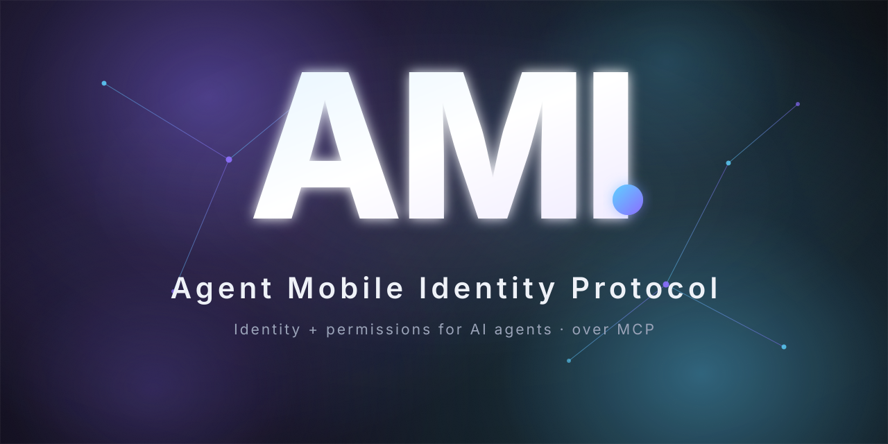
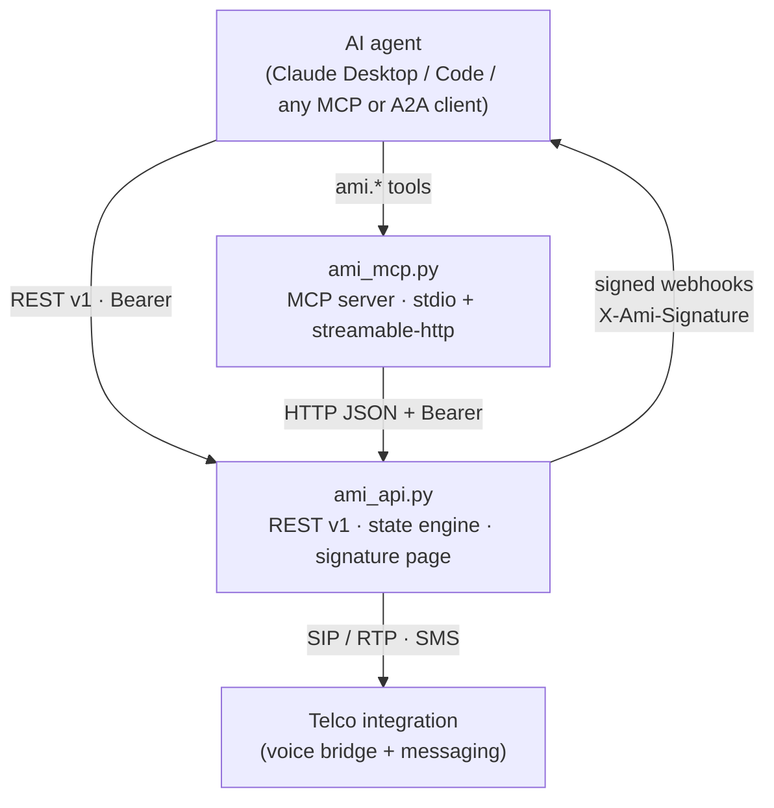
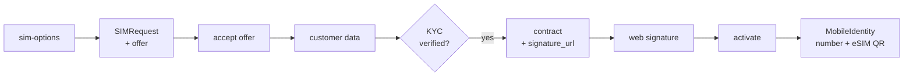

<p align="center">
  
</p>

<p align="center">
  <a href="LICENSE"></a>
  
  
  
  
  <a href="https://protocolami.com"></a>
</p>

<h3 align="center">The protocol that connects AI agents to a real mobile network.</h3>

<p align="center">
  A verifiable mobile identity and fine-grained permissions for autonomous agents —<br>
  contracted with real KYC, activated, and operated end to end over <b>MCP</b> and a <b>REST&nbsp;v1</b> API.
</p>

<p align="center">
  <a href="https://protocolami.com"><b>Live demo</b></a> ·
  <a href="https://mcp.protocolami.com/mcp/"><b>MCP endpoint</b></a> ·
  <a href="https://protocolami.com/openapi.json"><b>OpenAPI</b></a> ·
  <a href="https://protocolami.com/llms.txt"><b>llms.txt</b></a> ·
  <a href="#quickstart"><b>Quickstart</b></a>
</p>

---

## What is AMI

An AI agent can call code, browse, and reason — but it has no way to *be someone* on a phone network. AMI is the layer that gives it one.

**AMI (Agent Mobile Identity Protocol)** lets an agent request, **contract** (with real KYC) and **activate** a real mobile identity — phone number, voice, SMS, data — and then **operate** it. Every step is exposed as **28 MCP tools** under the `ami.*` namespace and as a **REST v1** API, both live in production.

It sits *on top of* MCP and A2A. Those standards carry the calls; AMI adds the two things they don't ship out of the box: a **verifiable identity** for the agent (Know-Your-Agent) and a **capability token** that scopes exactly what it may do — send SMS, place calls, spend budget, dial these countries and no others.

## Why AMI

- **Identity, not credentials in a config file.** A signer's identity is verified with real KYC before a contract can exist. The mobile identity that results is owned, auditable, and revocable.
- **Permissions the standard doesn't give you.** A scoped `agent_token` (Level 2, hard-rotatable) draws a hard boundary around what the agent can do — per-hour and per-day rate limits, a monthly budget, allowed country prefixes.
- **Real from contract to activation.** Offer → customer data → KYC → contract → web signature → activation is a production flow, not a mock. The agent gets a real number and an eSIM QR.
- **Operations, not just onboarding.** Once live, the agent sends SMS, places and hangs up calls, reads its own usage, and receives signed webhooks — all scoped to its own identity.
- **Bring your own voice.** AMI originates and bridges the call over SIP/RTP to the agent's endpoint. The agent brings its voice engine; AMI is the pipe. A real PSTN call answered by an AI agent through AMI has been proven live.
- **Built to be operated by machines.** Stdlib backend, official MCP SDK, an OpenAPI spec, an `llms.txt`, and a public one-shot demo endpoint. An agent can discover and drive the whole protocol on its own.

## Highlights

1. **End-to-end provisioning by the agent itself** — offer, customer data, legal-representative KYC, a contract with web signature, and activation — returning a phone number and an eSIM QR, over MCP or REST.
2. **KYC as a hard gate** — the signer's identity is verified (document + selfie on a public page) *before* a contract exists, with status polling all the way to `verified`.
3. **Voice without an engine of its own** — originate, list, and hang up calls, and bridge audio over SIP/RTP to the agent's endpoint. AMI is the pipe; the agent brings the voice.
4. **Two-way SMS scoped per identity** — send and list from the `agent_token` (Level 2).
5. **Fine-grained governance per identity** — SMS and call rate limits per hour and per day, a monthly budget, allowed country prefixes, and live usage reads.
6. **Signed outbound webhooks** — HMAC-SHA256 over `X-Ami-Signature`, with the secret handed out exactly once at registration.
7. **Two-level security** — a customer API key (Bearer) for the owner and a scoped `agent_token` with instant hard-rotate for the agent, on a multi-tenant backend with a full audit trail.
8. **Try it in one unauthenticated call** — `POST /v1/demo/quick` runs the whole flow, or connect remotely to the streamable-http MCP server.

---

## Architecture

An agent speaks MCP (or REST directly). The MCP server is a thin, typed façade over the REST v1 backend, which holds the state machine, the public signature page, and the telco/voice integration.



The provisioning state machine the agent drives end to end:



Once a `MobileIdentity` is live, the agent operates it with a scoped `agent_token`: SMS, voice, usage, limits, webhooks.

---

## Quickstart

### Fastest path — one public call, no auth

```bash
curl -X POST https://protocolami.com/v1/demo/quick
```

Runs the full lifecycle end to end and returns the resulting `MobileIdentity`.

### Connect the remote MCP server

From any MCP client that speaks streamable-http, point at:

```
https://mcp.protocolami.com/mcp/
```

> The trailing slash matters: without it the server replies `307`. The official SDK follows the redirect, but some clients don't.

MCP itself requires no extra auth — your Bearer travels through to the backend as `Authorization: Bearer <token>`.

### Run it locally

Setup the venv (stdlib only; `uv` optional):

```bash
uv venv .venv
uv pip install --python .venv/bin/python -r requirements.txt
# or:  python3 -m venv .venv && .venv/bin/pip install -r requirements.txt
```

**1 — Start the REST backend** (port `8000`):

```bash
AMI_API_KEY=dev_key AMI_PUBLIC_URL=http://localhost:8000 python3 ami_api.py
```

Without `AMI_API_KEY` the API starts in dev mode with no auth. `AMI_PUBLIC_URL` is used to build the `signature_url` returned by the contract.

**2 — Walk the full flow** (stdlib only, no `requests`):

```bash
AMI_API_URL=http://localhost:8000 AMI_API_KEY=dev_key python3 demo_flow.py
```

`demo_flow.py` runs the eight steps: health, SIMRequest + offer, accept offer, customer data, contract, signature via the public callback, activation, and a final status + audit read. See `examples/agent_quickstart.py` for the agent-side pattern.

**3 — Launch the MCP server** — stdio for local clients, `http` for remote:

```bash
AMI_API_URL=http://localhost:8000 AMI_API_KEY=dev_key .venv/bin/python ami_mcp.py        # stdio
AMI_API_URL=http://localhost:8000 AMI_API_KEY=dev_key .venv/bin/python ami_mcp.py http    # streamable-http :8001
```

### Wire it into a stdio MCP client

Add to `claude_desktop_config.json` (or any stdio MCP client config):

```json
{
  "mcpServers": {
    "ami": {
      "command": "/absolute/path/to/AMI/.venv/bin/python",
      "args": ["/absolute/path/to/AMI/ami_mcp.py"],
      "env": {
        "AMI_API_URL": "https://protocolami.com",
        "AMI_API_KEY": "<your-api-key>"
      }
    }
  }
}
```

Restart the client and the `ami.*` tools are available to the agent.

### SDKs

Typed clients live under [`sdk/`](sdk/) — [`sdk/python`](sdk/python) and [`sdk/typescript`](sdk/typescript) — each with its own README.

---

## Reference

### The 28 MCP tools (`ami.*`)

**Contracting / provisioning** — 10 tools

| Tool | What it does |
|------|--------------|
| `ami.search_sim_options` | List countries, SIM/eSIM types and capabilities (voice · SMS · data). |
| `ami.request_sim_offer` | Create a SIMRequest and return the platform's immediate offer. |
| `ami.accept_offer` | Accept an offer before generating a contract. |
| `ami.submit_customer_data` | Attach the customer's legal/tax data to the SIMRequest. |
| `ami.create_contract` | Generate the contract and return `signature_url` (KYC-verified when required). |
| `ami.get_contract_status` | Read the current state of a contract. |
| `ami.confirm_signature_status` | Check whether the contract is signed (semantic alias). |
| `ami.activate_sim_identity` | After signing, start provisioning and return the active MobileIdentity (number + eSIM QR). |
| `ami.get_identity_status` | Read the state of an active MobileIdentity. |
| `ami.cancel_request` | Cancel a SIMRequest before activation. |

**KYC** — 2 tools

| Tool | What it does |
|------|--------------|
| `ami.initiate_kyc` | Trigger legal-representative verification and return `verification_url` (idempotent). |
| `ami.get_kyc_status` | Read KYC state (`pending` · `in_review` · `verified` · `rejected` · `expired`). |

**SMS** — 2 tools

| Tool | What it does |
|------|--------------|
| `ami.send_sms` | Send an SMS from the active MobileIdentity (auth: `agent_token`, Level 2). |
| `ami.list_sms` | List the identity's SMS, newest first (filterable by inbound/outbound). |

**Voice (bridge-by-API)** — 5 tools

| Tool | What it does |
|------|--------------|
| `ami.place_call` | Originate an outbound call and bridge it over SIP to the agent's endpoint. |
| `ami.list_calls` | List the identity's calls (filterable by direction). |
| `ami.get_call` | Read one call's detail (scoped to the identity). |
| `ami.hangup_call` | Terminate an in-progress call (idempotent). |
| `ami.set_inbound_sip_uri` | Configure the SIP endpoint for inbound calls to the identity. |

**Governance / limits** — 4 tools

| Tool | What it does |
|------|--------------|
| `ami.get_limits` | Read limits (rate + budget + allowed countries) for an identity. |
| `ami.update_limits` | Patch limits (SMS/calls per hour/day, monthly budget, country prefixes). |
| `ami.get_usage` | Read current usage for an identity (auth: customer). |
| `ami.get_my_usage` | Read usage for the identity owning the `agent_token` (auth: agent). |

**Webhooks** — 3 tools

| Tool | What it does |
|------|--------------|
| `ami.create_webhook` | Register an outbound webhook for an identity; returns the secret once. |
| `ami.list_webhooks` | List the identity's webhooks (secret prefix only). |
| `ami.delete_webhook` | Delete a webhook by id. |

**Identity / audit** — 2 tools

| Tool | What it does |
|------|--------------|
| `ami.rotate_agent_token` | Hard-rotate an identity's `agent_token` (invalidates the previous one instantly). |
| `ami.list_events` | Return the latest AuditEvents (debug and inspection). |

### REST v1 endpoints

**Contracting / provisioning**

| Method | Path | Purpose |
|--------|------|---------|
| `GET` | `/v1/health` | Healthcheck (public) |
| `GET` | `/v1/sim-options` | Available countries and SIMs |
| `POST` | `/v1/sim-requests` | Create SIMRequest + offer |
| `POST` | `/v1/sim-requests/{id}/cancel` | Cancel a SIMRequest |
| `POST` | `/v1/sim-requests/{id}/customer-data` | Attach customer data |
| `POST` | `/v1/offers/{id}/accept` | Accept an offer |
| `POST` | `/v1/contracts` | Create contract + `signature_url` |
| `GET` | `/v1/contracts/{id}` | Read a contract |
| `GET` | `/v1/sign/{id}` | Public HTML signature page |
| `POST` | `/v1/sign/{id}/confirm` | Signature form callback (public) |
| `POST` | `/v1/mobile-identities/activate` | Activate the MobileIdentity (accepts optional `voice_url`) |
| `GET` | `/v1/mobile-identities/{id}` | Read a MobileIdentity |

**KYC**

| Method | Path | Purpose |
|--------|------|---------|
| `POST` | `/v1/sim-requests/{id}/kyc/initiate` | Trigger KYC (returns `verification_url`) |
| `GET` | `/v1/sim-requests/{id}/kyc` | KYC state for the request |

**Identity / tokens / inbound voice**

| Method | Path | Purpose |
|--------|------|---------|
| `POST` | `/v1/mobile-identities/{id}/rotate-token` | Hard-rotate the `agent_token` |
| `POST` | `/v1/mobile-identities/{id}/inbound-config` | Set the SIP endpoint for inbound calls |

**Governance / limits**

| Method | Path | Purpose |
|--------|------|---------|
| `GET` | `/v1/mobile-identities/{id}/limits` | Read limits |
| `POST` | `/v1/mobile-identities/{id}/limits` | Update limits |
| `GET` | `/v1/mobile-identities/{id}/usage` | Current usage (auth: customer) |

**Webhooks**

| Method | Path | Purpose |
|--------|------|---------|
| `POST` | `/v1/mobile-identities/{id}/webhooks` | Create outbound webhook |
| `GET` | `/v1/mobile-identities/{id}/webhooks` | List webhooks |
| `POST` | `/v1/mobile-identities/{id}/webhooks/{wh}/delete` | Delete a webhook |

**Operations v2 · scoped by `agent_token` (Level 2)**

| Method | Path | Purpose |
|--------|------|---------|
| `GET` | `/v1/agent/self` | Info on the identity owning the token |
| `POST` | `/v1/agent/sms/send` | Send SMS |
| `GET` | `/v1/agent/sms` | List SMS (filterable by direction) |
| `POST` | `/v1/agent/calls/place` | Originate a SIP-bridged call |
| `GET` | `/v1/agent/calls` | List calls |
| `GET` | `/v1/agent/calls/{id}` | Call detail |
| `POST` | `/v1/agent/calls/{id}/hangup` | Terminate a call |
| `GET` | `/v1/agent/usage` | Usage for the token's identity |

**Admin · multi-tenancy** (auth: `AMI_ADMIN_KEY`)

| Method | Path | Purpose |
|--------|------|---------|
| `POST` | `/v1/admin/customers` | Create a customer-account (API key shown once) |
| `GET` | `/v1/admin/customers` | List customer-accounts (no secret) |
| `POST` | `/v1/admin/customers/{id}/rotate-key` | Rotate an API key |
| `POST` | `/v1/admin/customers/{id}/suspend` | Suspend a customer |
| `POST` | `/v1/admin/customers/{id}/activate` | Reactivate a customer |

**Audit / demo / public pages**

| Method | Path | Purpose |
|--------|------|---------|
| `GET` | `/v1/events` | Latest AuditEvents |
| `POST` | `/v1/demo/quick` | Full end-to-end flow in one call (public, no auth) |
| `GET` | `/identity/{id}` | Public page for an active MobileIdentity |
| `GET` | `/spec` | Protocol spec (HTML) |
| `GET` | `/diagram` | Animated lifecycle of the stack |
| `GET` | `/docs` | Interactive documentation portal (bilingual) |

Full machine-readable surface: [`openapi.json`](https://protocolami.com/openapi.json).

### Environment variables

| Variable | Component | Description |
|----------|-----------|-------------|
| `AMI_API_URL` | mcp / demo | Base URL of the AMI backend. Default `http://localhost:8000`. |
| `AMI_API_KEY` | api / mcp | Customer Bearer token. If unset on the API, it starts in dev mode with no auth. |
| `AMI_ADMIN_KEY` | api | Master key for the `/v1/admin/*` endpoints. |
| `AMI_PUBLIC_URL` | api | Public URL used to build `signature_url` on contracts. |
| `AMI_MCP_HOST` | mcp http | Bind host for the HTTP transport. Default `0.0.0.0`. |
| `AMI_MCP_PORT` | mcp http | Port for the HTTP transport. Default `8001`. |
| `PORT` | api | HTTP backend port. Default `8000`. |

The agent, once provisioned, authenticates its operations with a scoped `agent_token` (Level 2) rather than the customer key.

---

## Status

**Live in production, today.** The full contractual lifecycle is real and deployed: offer, customer data, legal-representative KYC, contract with web signature, and activation, followed by SMS, voice, governance, webhooks, and audit — all reachable right now at [`protocolami.com`](https://protocolami.com) and over the streamable-http MCP server.

- **Real:** the entire negotiation, KYC gate, contract and signature, the two-level auth model, multi-tenancy, the number inventory with automatic assignment at onboarding, and the voice bridge — a real PSTN call answered by an AI agent through AMI's SIP/RTP ↔ Media Streams (μ-law) bridge has been proven live, compatible with voice frameworks that speak the Media Streams protocol.
- **The one simulated piece:** the physical SIM. A licensed telco partner with its own infrastructure is in the interconnection phase; the contract + KYC + operations flow around it is already real and stays unchanged when it lands.

**Verified from source:** 28 MCP tools · 41 catalogued REST endpoints · green CI on Python 3.11 and 3.12 · Python stdlib backend with the official MCP SDK (stdio + streamable-http).

---

## Contributing

Issues and pull requests are welcome. The backend is pure Python stdlib and the test suite runs with `pytest` on Python 3.11 / 3.12:

```bash
.venv/bin/python -m pytest
```

## Security

Report vulnerabilities privately rather than opening a public issue. Outbound webhooks are signed with HMAC-SHA256 (`X-Ami-Signature`); customer and admin keys and every `agent_token` support instant hard-rotation.

## License

Licensed under the Apache License, Version 2.0 — see [`LICENSE`](LICENSE).

<p align="center"><br>
  <b>AMI</b> — The protocol that connects AI agents to a real mobile network.<br>
  <a href="https://protocolami.com">protocolami.com</a>
</p>
