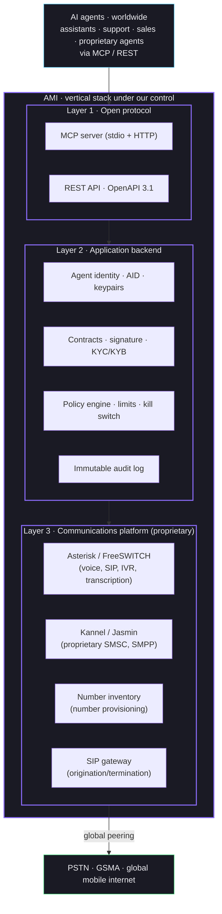
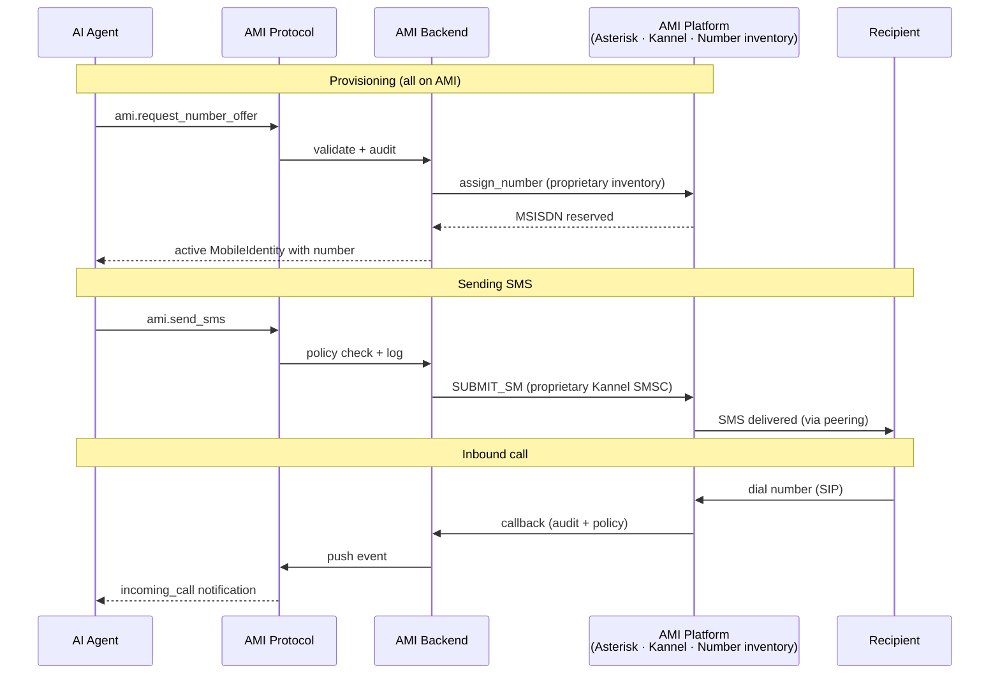
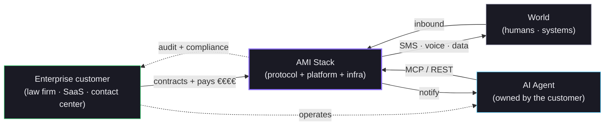
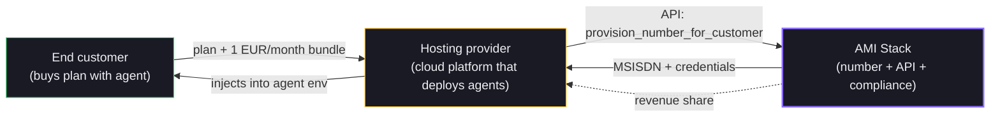

# AMI · Vertical stack for agent mobile identity

**Project:** Parallax IEI
**Document:** full stack and layer breakdown
**Version:** v2 · May 2026
**Status:** v1 in production · proprietary platform under construction

---

## In one sentence

> AMI controls the full stack: the protocol that agents speak, the application platform, the communications infrastructure (softswitch, SMSC, number provisioning, SIP gateway) and the operation itself. AMI is a proprietary product and a proprietary operation — not an integration on top of anyone else. It is the cloud-native telco for AI agents — our own numbers, SMS and voice over the internet, no physical SIMs.

---

## Why we control the entire stack

The software industry for agents is being born, and almost every new player is making the same strategic mistake: **building the product on top of third-party APIs or on top of a traditional operator**. That turns the company into middleware that lives off whatever margin the vendor of the moment chooses to leave behind, and never gets to control its economics, its roadmap, or its defensibility.

AMI does the opposite. Every layer, from the MCP protocol that the agent sees down to the softswitch that originates the call, is **our** code and **our** servers. Physical peering to the PSTN is solved as a standard interconnect, the same way any operator in the world does it — that is operations, not product.

The result:

- **Our own margins.** We don't pay rent-seeking to intermediaries or to retail operators. What we charge the customer is our full margin.
- **Speed.** Any feature that needs adjustments in the softswitch, the SMSC or the SIP gateway, we ship in hours. No waiting on an external vendor's roadmap.
- **Defensibility.** If tomorrow any external API changes pricing or disappears, we are unaffected. Our stack stays alive.
- **Deeply integrated features.** Native MCP tools, per-agent policy, immutable audit, signed contracts bound to a number, governed identity — all of it can be integrated deep because we control every layer. None of this is possible on top of third-party APIs.

---

## The stack, layer by layer

### Diagram 1 — Everything AMI controls

**Three layers, all ours.** The bottom block (the global PSTN) is not a product component: it is where an operator delivers its traffic. We maintain peering with global networks, just like any operator in the world — that is technical operations, not strategic dependency.

### Each component, described

| Layer | Component | Function | Technology |
|---|---|---|---|
| 1 | **MCP server** | `ami.*` tools for agents | Python + official MCP SDK |
| 1 | **REST API** | OpenAPI 3.1 for non-MCP clients | Python stdlib |
| 2 | **Agent identity (AID)** | DID + keypair + ownership credential | Ed25519 + JWT-VC |
| 2 | **Contracts & signature** | Contract generation, electronic signature, webhook | Proprietary backend + proprietary signature service |
| 2 | **Policy engine** | Per-agent limits, human approval, kill switch | Proprietary backend |
| 2 | **Audit log** | Append-only, hash chain, compliance | Postgres + SHA-256 hash chain |
| 3 | **Asterisk / FreeSWITCH** | Voice origination and termination · IVR · recording · transcription · human handoff | Open source, proprietary cluster |
| 3 | **Kannel / Jasmin** | Proprietary SMSC · SMPP server · SMS origination/reception | Open source, proprietary cluster |
| 3 | **Number inventory** | Number lifecycle, assignment to agents, range management | Proprietary backend |
| 3 | **SIP gateway** | Origination and termination against global networks, peering | Open source, proprietary cluster |

**The entire stack under our direct control.** The only thing outside our code is the public networks (PSTN, GSMA, mobile internet) — but that is not a vendor, that is the world. Any operator on the planet has peering with those networks.

---

## The flow, step by step · everything runs through our servers

### Diagram 2 — A call or SMS from an agent, end-to-end

**Notice how every decision flows through our stack** — policy, audit, identity, signaling, origination and termination. Global networks only appear as the destination or origin of traffic, never as an intermediate actor.

---

## The actor map (how value flows look)

### Diagram 3 — Contractual and economic flows

**The customer's entire contractual relationship is with AMI.** There are no visible or invisible intermediaries between us and the customer, nor between us and the world. The customer pays one actor (us), holds one contract (ours), gets one compliance posture (ours), and every value flow sits on our books.

---

## What we already have today

We are not describing a future project. There are pieces in production and pieces under construction:

### In production

- **Layer 1 complete**: MCP server with 11 `ami.*` tools and a REST API with 18 endpoints, both publicly accessible at `https://protocolami.com` and `https://mcp.protocolami.com/mcp/`.
- **Layer 2 partial**: contracts generated, electronic signature via our own page, audit log on every state transition, explicit state machine.
- **pytest test suite** with 58 checks of the public contract.
- **Validated with external agents**: an agent connected from another machine over a messaging channel has executed the full flow end-to-end without human assistance.

### Under construction (next few weeks)

- **Layer 3** brought up by the Parallax technical partner who contributes all the operational telco-platform experience. Asterisk + Kannel + number inventory + SIP gateway sized for agent volume from day one.
- **Layer 2 complete**: agent identity (AID with DID + keypair), policy engine with limits, integrated KYC/KYB.
- **Global interconnect**: technical peering with national networks in the first markets, in parallel with the licensing process.

### Realistic timeline

| Milestone | Timeframe |
|---|---|
| Full stack brought up and wired into the AMI adapter | 4-6 weeks |
| First real SMS and first real call through our platform | 6-8 weeks |
| Pilot with 2-3 real enterprise customers | 10-12 weeks |
| Proprietary numbering in 3-5 initial countries | 12-16 weeks |
| Operator license in Spain processed in parallel | in progress |

---

## Distribution channel · bundles with hosting providers

There is a massive and under-appreciated opportunity: **hosting providers** are already selling **AI agents deployed as a service**. One of them alone publicly advertises more than **100,000 deployed agents** in its plans; several cloud platforms are moving in the same direction.

These agents are born with everything they need to operate in the cloud — **except a phone number of their own**. No hosting provider has telco infrastructure. It is the perfect gap for AMI.

### The channel proposition

Offer each hosting provider an integrated bundle: the end customer pays, for example, **+1 EUR/month** on top of their plan and automatically receives:

- An AMI number provisioned in their country.
- API already wired into the agent from the very first boot (config injected via the provider's environment variables).
- SMS and voice operational from day one.
- Compliance, contract and audit log managed by AMI.

Typical negotiable split: **60% AMI / 40% provider**. AMI covers numbering, infrastructure and operation. The provider covers integration, first-level support and brand visibility.

### What the integration looks like

**The end customer does not sign with AMI** — the provider holds the contractual relationship. For the customer, the number simply appears "included in the plan". For us, every agent provisioned by a partner is an MSISDN on our platform generating recurring revenue.

### Why this is asymmetric in our favor

- **Free distribution at massive scale.** If a single large hosting provider turns it on by default, that is roughly 100K new customers per year with AMI identity at zero marketing cost to us.
- **Near-zero acquisition cost.** The customer has already paid for their agent; +1 EUR/month for a real, working number is marginal next to the rest of the plan.
- **Soft lock-in.** Once an agent has its number, with compliance and audit log attached, migrating it is work. Whoever starts on AMI stays on AMI.
- **Multi-provider from day one.** Not exclusive with anyone; we offer it to every platform that monetizes agents. Each bundle is independent.
- **Recurring business, not a project.** We are not selling "an integration" — we are selling a live channel with monthly margin.

### There are precedents

The "infrastructure as a default piece of the platform" model has been proven for over a decade:

- In **fintech**, the default payment processor integrated into the largest e-commerce platform.
- In **web infrastructure**, CDN and edge services integrated out of the box into cloud-native hosting.
- In **communications**, messaging APIs already transparent in some large B2B SaaS.

For **AI agents with a real phone number**, no one has this model yet. The window closes the moment a competitor locks it down first with one of the large hosting players. Moving now is the play.

### How to kick off

1. Identify the first pilot provider. The natural candidate is the cloud host most visibly selling deployed agents (publicly announced volume of 100K+ agents already in production), with a captive end-customer base waiting for extra capabilities.
2. Simple API exposed by AMI: `POST /v1/partners/{partner_id}/provision` that takes `customer_ref` + `country` and returns `phone_number` + `credentials`. A single call. Documentation and integration example ready within a week.
3. Optional co-branding bundle: "Powered by AMI" in the partner dashboard, or invisible if they prefer their own branding.
4. Pricing: revenue-share commission on the bundle, no minimum commitments up front to reduce partner friction. Adjustable once volume justifies it.

---

## Why this moment

- **MCP is becoming the standard** for how agents talk to external services. Whoever defines today how the telco network is addressed from MCP defines the rules of the market.
- **The enterprise agent market** is going from tens of thousands to millions over the next 12-24 months. Every serious agent will need real mobile identity, not a wrapper of someone else's APIs.
- **Owning the stack from day one** is the difference between a 10% margin business (reselling someone else's API) and a 60-80% margin business (controlling the stack).
- **The technical partner contributing the platform layer** already brings proven experience, code and operations. This is not a project to build from scratch — it is a project to integrate with a protocol that is already alive.

---

## What we are NOT

To avoid any misunderstanding:

- **We are not a wrapper of someone else's APIs.** Third-party CPaaS and communications SDKs are indirect competitors, not our providers.
- **We are not a reseller of an operator.** Traditional operators serve humans; we serve agents with our own infrastructure.
- **We do not depend on anyone's roadmap.** If tomorrow any external API changes or disappears, our stack stays operational.
- **We are not looking to integrate with an operator** that would dictate our strategy. Our stack is vertical and complete from day one.

---

## Contact

**Daniel Gamino** · Parallax IEI
Public repo: `https://github.com/Gamino17/AMI`
Protocol spec: `https://protocolami.com/spec`
Live demo: `https://protocolami.com`
Visual experience: `https://protocolami.com/experience`
