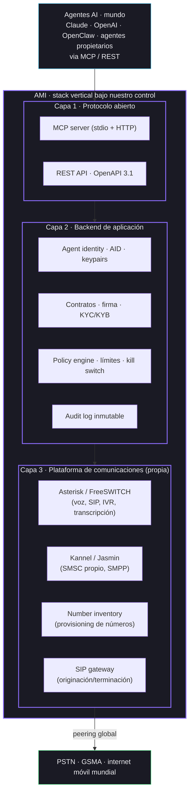
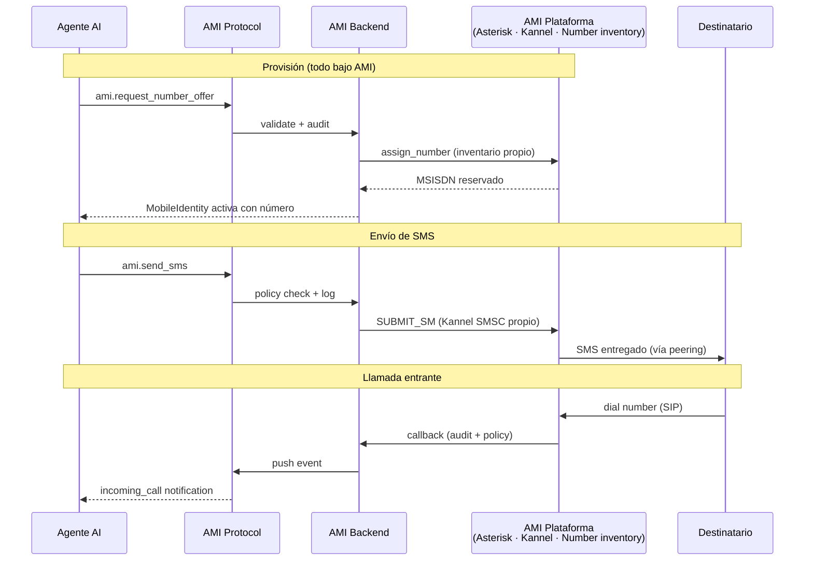
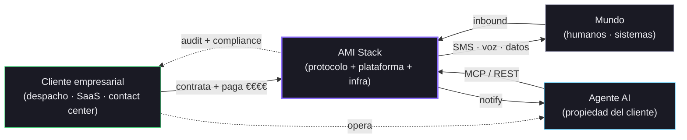

# AMI · Stack vertical para identidad móvil de agentes

**Proyecto:** Parallax IEI
**Documento:** stack completo y división de capas
**Versión:** v2 · mayo 2026
**Estado:** v1 en producción · plataforma propia en construcción

---

## En una frase

> AMI controla la pila completa: el protocolo que hablan los agentes, la plataforma de aplicación, la infraestructura de comunicaciones (softswitch, SMSC, provisioning de números, SIP gateway) y la operación. No somos un wrapper de Twilio ni un revendedor de operadores. Somos la telco cloud-native de los agentes AI — números propios, SMS y voz por internet, sin SIMs físicas.

---

## Por qué controlamos el stack entero

La industria del software para agentes está naciendo y casi todos los actores nuevos cometen el mismo error estratégico: **construir el producto encima de Twilio o de un operador tradicional**. Eso convierte a la empresa en un middleware que vive del margen que le deja el proveedor de turno y nunca llega a controlar su economía, ni su roadmap, ni su defensibilidad.

AMI hace lo contrario. Cada capa, desde el protocolo MCP que ve el agente hasta el softswitch que origina la llamada, es código y servidores **nuestros**. El peering físico al PSTN se resuelve como interconnect estándar, igual que cualquier operador del mundo — es operación, no producto.

El resultado:

- **Márgenes propios.** No pagamos rent-seeking a Twilio, Vonage o un operador retail. Lo que cobramos al cliente es nuestro margen, no la sobra que nos deja un intermediario.
- **Velocidad.** Cualquier feature que necesite ajustes en el softswitch, en el SMSC o en el SIP gateway la hacemos en horas. Sin esperar al roadmap de un proveedor externo.
- **Defensibilidad.** Si mañana Twilio decide bajar precios para matar competencia o un operador retira su API, no nos afecta. Nuestro stack sigue vivo.
- **Features que Twilio no puede.** Tools MCP nativas, política por agente, auditoría inmutable, contratos firmados vinculados a número, identidad gobernada — todo se puede integrar profundo porque controlamos todas las capas.

---

## El stack, capa por capa

### Diagrama 1 — Todo lo que controla AMI

**Tres capas, todas nuestras.** El bloque inferior (PSTN mundial) no es un componente de producto: es a donde un operador entrega su tráfico. Nosotros mantenemos peering con redes globales, igual que cualquier operador del mundo — es operación técnica, no dependencia estratégica.

### Cada componente, descrito

| Capa | Componente | Función | Tecnología |
|---|---|---|---|
| 1 | **MCP server** | Tools `ami.*` para agentes | Python + SDK oficial MCP |
| 1 | **REST API** | OpenAPI 3.1 para clientes no-MCP | Python stdlib |
| 2 | **Agent identity (AID)** | DID + keypair + ownership credential | Ed25519 + JWT-VC |
| 2 | **Contracts & signature** | Generación contrato, firma electrónica, webhook | Backend propio + servicio firma propio |
| 2 | **Policy engine** | Límites por agente, aprobación humana, kill switch | Backend propio |
| 2 | **Audit log** | Append-only, hash chain, compliance | Postgres + hash SHA-256 chain |
| 3 | **Asterisk / FreeSWITCH** | Originación y recepción de voz · IVR · grabación · transcripción · transferencia humano | Open source, cluster propio |
| 3 | **Kannel / Jasmin** | SMSC propio · SMPP server · originación/recepción SMS | Open source, cluster propio |
| 3 | **Number inventory** | Alta/baja de números, asignación a agentes, gestión de rangos | Backend propio |
| 3 | **SIP gateway** | Originación y terminación contra redes globales, peering | Open source, cluster propio |

**Toda la pila bajo nuestro control directo.** Lo único fuera de nuestro código son las redes públicas (PSTN, GSMA, internet móvil) — pero eso no es un proveedor, es el mundo. Cualquier operador del planeta tiene peering con esas redes.

---

## El flujo, paso a paso · todo pasa por nuestros servidores

### Diagrama 2 — Una llamada o SMS de un agente, end-to-end

**Observa cómo todas las decisiones pasan por nuestro stack** — políticas, auditoría, identidad, signaling, originación y terminación. Las redes globales solo aparecen como destino o origen de tráfico, no como un actor intermedio.

---

## El mapa de actores (cómo se ven los flujos de valor)

### Diagrama 3 — Flujos contractuales y económicos

**Toda la relación contractual del cliente es con AMI**. No hay intermediarios visibles ni invisibles entre nosotros y el cliente, ni entre nosotros y el mundo. El cliente paga a un actor (nosotros), tiene un contrato (nuestro), tiene compliance (nuestro), y todos los flujos de valor están bajo nuestra cuenta y razón.

---

## Lo que ya tenemos hoy

No estamos describiendo un proyecto futuro. Hay piezas en producción y piezas en construcción:

### En producción

- **Capa 1 completa**: MCP server con 11 tools `ami.*` y REST API con 18 endpoints, ambos accesibles públicamente en `https://protocolami.com` y `https://mcp.protocolami.com/mcp/`.
- **Capa 2 parcial**: contratos generados, firma electrónica vía página propia, audit log con cada transición de estado, máquina de estados explícita.
- **Suite de tests pytest** con 58 verificaciones del contrato público.
- **Validado con agentes externos**: OpenClaw conectado desde otra máquina vía Telegram ha ejecutado el flujo completo end-to-end.

### En construcción (próximas semanas)

- **Capa 3** levantada por el socio técnico de Parallax que aporta toda la experiencia operativa de plataforma telco. Asterisk + Kannel + inventario de numeración + SIP gateway dimensionados para volumen de agentes desde el día uno.
- **Capa 2 completa**: agent identity (AID con DID + keypair), policy engine con límites, KYC/KYB integrado.
- **Interconnect global**: peering técnico con redes nacionales en los primeros mercados, en paralelo a la tramitación de licencia.

### Calendario realista

| Hito | Plazo |
|---|---|
| Stack completo levantado y enchufado al adapter de AMI | 4-6 semanas |
| Primer SMS y primera llamada reales por nuestra plataforma | 6-8 semanas |
| Piloto con 2-3 clientes empresariales reales | 10-12 semanas |
| Numeración propia en 3-5 países iniciales | 12-16 semanas |
| Licencia de operador en España tramitada en paralelo | en proceso |

---

## Por qué este momento

- **MCP se está convirtiendo en el estándar** de cómo los agentes hablan con servicios externos. Quien define hoy cómo se habla con la red telco desde MCP, define las reglas del mercado.
- **El mercado de agentes empresariales** está pasando de decenas de miles a millones en los próximos 12-24 meses. Cada agente serio necesitará identidad móvil real, no un wrapper de Twilio.
- **Tener el stack propio desde el día uno** es la diferencia entre un negocio de margen 10% (revender API ajena) y un negocio de margen 60-80% (controlar la pila).
- **El socio técnico que aporta la capa de plataforma** ya tiene experiencia, código y operativa probados. No es un proyecto a construir desde cero — es un proyecto a integrar con el protocolo que ya está vivo.

---

## Lo que NO somos

Para evitar malentendidos:

- **No somos un wrapper de Twilio.** Twilio, Vonage, MessageBird son nuestros competidores indirectos, no nuestros proveedores.
- **No somos un revendedor de un operador.** Telefónica, Vodafone y Orange operan a humanos; nosotros operamos a agentes con nuestra propia infraestructura.
- **No dependemos del roadmap de nadie.** Si mañana Anthropic, Twilio o un operador retira una API, nuestro stack sigue operativo.
- **No buscamos integrarnos con un operador** que decida nuestra estrategia. Nuestro stack es vertical y completo desde el día uno.

---

## Contacto

**Daniel Gamino** · Parallax IEI
Repo público: `https://github.com/Gamino17/AMI`
Spec del protocolo: `https://protocolami.com/spec`
Demo en vivo: `https://protocolami.com`
Experiencia visual: `https://protocolami.com/experience`
